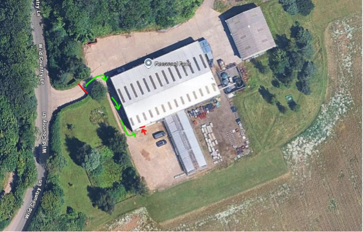

# Getting there

!!! warning "No public access"
    **Fenswood Farm is not publicly-accessible**, these instructions are for research collaborators and students.
    
    Flying sessions are weather-dependent, so check for confirmation the day before and on the day.

## Location

Fenswood Farm is in the village of Long Ashton, a short journey from central Bristol.

**Address: Fenswood Farm, Wild Country Way, Long Ashton BS41 9AG.**

Lab entrance: [Google Maps](https://maps.app.goo.gl/MAif7mConQrGM8Gn9) / [What3Words](https://w3w.co/appeal.voted.unrealistic)

## Transport

Options from the University's Clifton campus:

### Bus (recommended)

The closest bus from the Clifton campus departs from The Centre, approximately 10 minutes’ walk from Queen’s Building. These buses start at Bristol Bus Station, and head through the centre of town via Anchor Road. The journey from Anchor Road takes around 15 minutes, followed by an additional 5-minute walk down Wild Country Lane to Fenswood Farm.

Route (timetable linked):

* [X9 towards Nailsea](https://journeyplanner.travelwest.info/service/39-X9-%25-y10-1/direction/outbound)

The service runs approximately every 30 minutes, and timetables can be checked via the Travelwest or First Bus apps for the most accurate, real-time information. You may pay by contactless on the bus, but tickets are cheaper in advance via the First Bus app.

If you're not familiar with UK buses: raise your arm clearly to hail the bus to stop, otherwise it will go past you! The bus will head out of Bristol and into Long Ashton village, and after you've passed the village centre you'll see a '30' speed limit sign, then a zebra crossing - ding the bell for the bus to stop when you see ahead that the houses stop and trees and fields start. Get off the bus at Warren Lane, just as the bus leaves Long Ashton village.

### Bicycle

Cycling is also a good option, and [National Cycle Route 33](https://www.walkwheelcycletrust.org.uk/find-a-route-on-the-national-cycle-network/route-33/) takes you from the city centre right past Fenswood Farm.

### Taxi

Taxis average around £15–£20 each way from the Clifton campus. Local taxis are bookable via the Veezu app; Uber and other apps also operate in Bristol.

### Driving

Limited parking is available at the farm, so please plan accordingly and car-share where possible.

## Access

Access is UCard controlled, and staff only - students and visitors should contact staff on arrival.

The Lab entrance (and parking) is on the south side of the building - turn right through the main gate, along the side of the main building and round to the left.

